## ProtocolStack
[](https://github.com/42milez/ProtocolStack/actions/workflows/ci.yml) [](https://codecov.io/gh/42milez/ProtocolStack) [](https://goreportcard.com/report/github.com/42milez/ProtocolStack)  [](https://github.com/42milez/ProtocolStack/blob/main/LICENSE)  
This repository is for learning network programming in Go and mainly aims to implement TCP/IP stack.

## Overview
<a href="https://olivermak.es/">
  
</a>

## Supported Protocols

- [x] Ethernet
- [x] ARP
    - [x] Request
    - [x] Reply
- [x] IP
    - [x] v4
    - [ ] v6
- [x] ICMP
    - [x] Echo Request
    - [x] Echo Reply
- [x] TCP
    - [x] Receiving data less than MTU
    - [ ] Receiving data which exceeds MTU
    - [ ] Sending data
    - [ ] Flow Control
    - [ ] Retransmission
- [ ] UDP

## Requirements
- OS: Linux
- Go: 1.14.x or higher

## Directory Structure
```
ProtocolStack/
├── .github
│   └── workflows .. Configurations for GitHub Actions
├── src
│   ├── binary ..... provides utilities for binary operation
│   ├── cli ........ cli command difinitions
│   ├── error ...... error definitions
│   ├── log ........ provides utilities for logging
│   ├── monitor .... provides monitoring features to watch services
│   ├── mw ......... provides a layer to connect network layer with ethernet layer
│   ├── net ........ protocol implementations
│   │   ├── arp .... arp
│   │   ├── eth .... ethernet protocol
│   │   ├── icmp ... icmp
│   │   ├── ip ..... ip
│   │   └── tcp .... tcp
│   ├── repo ....... provides repositories of various entities
│   ├── syscall .... provides system call wrappers
│   ├── test ....... test cases
│   ├── time ....... provides utilities for time operation
│   └── worker ..... provides various types used by worker
└── vagrant
    └── provisioners provides provisioning scripts
```

## Instructions
ProtocolStack needs a TAP device for its capability. For the reason, this project uses a virtual machine (Linux) to run the application.

### 1. Preparing for using the virtual machine
Software required is as follows: 

- [Mutagen](https://github.com/mutagen-io/mutagen)
- [Vagrant](https://www.vagrantup.com)
- [VirtualBox](https://www.virtualbox.org)

Note: Mutagen synchronizes files between local system and virtual machine.

### 2. Controlling the virtual machine
`vm.sh` controls the virtual machine. The available commands are as follows:

- `start`
- `stop`
- `restart`

You can perform the commands below:

```shell
> ./vm.sh start   # Start the VM and create a Mutagen session.
> ./vm.sh stop    # Stop the VM and terminate the Mutagen session.
> ./vm.sh restart # Restart the VM and recreate the Mutagen session.
```

#### Note: Remote debugging with GoLand
- See [the instruction](https://github.com/42milez/ProtocolStack/wiki/Remote-Debugging-with-GoLand) for more detail.
- Related information:
  - [What Are Run Targets & How To Run Code Anywhere](https://blog.jetbrains.com/go/2021/04/29/what-are-run-targets-and-how-to-run-code-anywhere)
  - [How to use Docker to compile and run Go code from GoLand](https://blog.jetbrains.com/go/2021/04/30/how-to-use-docker-to-compile-go-from-goland)
  - [Compile and run Go code using WSL 2 and GoLand](https://blog.jetbrains.com/go/2021/05/05/compile-and-run-go-code-using-wsl-2-and-goland)

### 3. Compile
It is able to compile the application with `make`:
```shell
> make compile
```

### 4. Running application
#### Start as echo server
```shell
./bin/pstack server
```

#### Start as client
###### Send ICMP request:
```shell
./bin/pstack ping -c 192.0.2.1
```

Note: `make` supports the commands below:
- `build` build project
- `clean` clean up caches
- `compile` resolve dependencies, and build the program
- `fmt` run formatter
- `gen` generate source code
- `lint` run linters (golangci-lint)
- `resolve` resolve dependencies
- `test` run all tests

## Examples
- [ICMP Echo Reply](https://github.com/42milez/ProtocolStack/wiki/Example:-ICMP-Echo-Reply)
- [ICMP Echo Request](https://github.com/42milez/ProtocolStack/wiki/ICMP-Echo-Request)
- [3-Way Handshake](https://github.com/42milez/ProtocolStack/wiki/3-Way-Handshake)

## References
- Articles
  - [Demystifying memory management in modern programming languages](https://deepu.tech/memory-management-in-programming)
- Blogs
  - [golangspec](https://medium.com/golangspec)
  - [Vincent Blanchon](https://medium.com/@blanchon.vincent)
- Books
  - [Hands-On High Performance with Go](https://www.packtpub.com/product/hands-on-high-performance-with-go/9781789805789)
  - [Mastering Go - Second Edition](https://www.packtpub.com/product/mastering-go-second-edition/9781838559335)
  - [Multiplayer Game Programming: Architecting Networked Games](https://www.oreilly.com/library/view/multiplayer-game-programming/9780134034355)
  - [TCP/IP Illustrated](https://en.wikipedia.org/wiki/TCP/IP_Illustrated)
- Docs
  - Codecov
    - [About the Codecov yaml](https://docs.codecov.io/docs/codecov-yaml)
    - [Codecov Delta](https://docs.codecov.io/docs/codecov-delta)
  - Docker
    - [Compose file](https://docs.docker.com/compose/compose-file)
    - [Dockerfile](https://docs.docker.com/engine/reference/builder)
    - [Overview of Docker Compose](https://docs.docker.com/compose)
  - fedora
      - [DNF, the next-generation replacement for YUM](https://dnf.readthedocs.io/en/latest/index.html)
      - [Understanding and administering systemd](https://docs.fedoraproject.org/en-US/quick-docs/understanding-and-administering-systemd)
  - GitHub Actions
    - [Reference](https://docs.github.com/en/actions/reference)
  - Mutagen
    - [File synchronization](https://mutagen.io/documentation/synchronization)
  - Slack
    - Builder
      - [Block Kit](https://app.slack.com/block-kit-builder/T82HLGL84#%7B%22blocks%22:%5B%5D%7D)
      - [Message](https://api.slack.com/docs/messages/builder?msg=%7B%22text%22%3A%22I%20am%20a%20test%20message%22%2C%22attachments%22%3A%5B%7B%22text%22%3A%22And%20here%E2%80%99s%20an%20attachment!%22%7D%5D%7D)
    - [Reference guides for app features](https://api.slack.com/reference)
  - UI
    - [Error Message Guidelines](https://docs.microsoft.com/en-us/windows/win32/debug/error-message-guidelines?redirectedfrom=MSDN)
    - [Messages: UI Text Guidelines](https://docs.microsoft.com/en-us/previous-versions/windows/desktop/bb226791(v=vs.85))
  - Vagrant
    - [Vagrantfile](https://www.vagrantup.com/docs/vagrantfile)
- Go
  - Articles
    - [A Closer Look at Golang From an Architect’s Perspective](https://thenewstack.io/a-closer-look-at-golang-from-an-architects-perspective)
    - [Go at Google: Language Design in the Service of Software Engineering](https://talks.golang.org/2012/splash.article)
    - [Go talks](https://talks.golang.org)
    - [Golang tips: why pointers to slices are useful and how ignoring them can lead to tricky bugs](https://medium.com/swlh/golang-tips-why-pointers-to-slices-are-useful-and-how-ignoring-them-can-lead-to-tricky-bugs-cac90f72e77b)
  - Docs
      - [Command compile](https://golang.org/cmd/compile)
      - [Command vet](https://golang.org/cmd/vet)
      - [Compiler And Runtime Optimizations](https://github.com/golang/go/wiki/CompilerOptimizations)
      - [Data Race Detector](https://golang.org/doc/articles/race_detector)
      - [Effective Go](https://golang.org/doc/effective_go)
      - [Frequently Asked Questions (FAQ)](https://golang.org/doc/faq)
        - [Should I define methods on values or pointers?](https://golang.org/doc/faq#methods_on_values_or_pointers)
          - [Value vs Pointer Receivers](https://h12.io/article/value-vs-pointer-receivers)
      - [Getting Started with Code Coverage for Golang](https://about.codecov.io/blog/getting-started-with-code-coverage-for-golang)
      - [Go by Example](https://gobyexample.com)
      - [Package testing](https://golang.org/pkg/testing)
      - [The Go Memory Model](https://golang.org/ref/mem)
      - [The Go Programming Language Specification](https://golang.org/ref/spec)
  - Packages
    - [github.com/google/go-cmp/cmp](https://pkg.go.dev/github.com/google/go-cmp/cmp)
- Makefile
  - [A Good Makefile for Go](https://kodfabrik.com/journal/a-good-makefile-for-go)
  - [GNU Make Manual](https://www.gnu.org/software/make/manual)
- Papers
  - [Fifty Shades of Congestion Control: A Performance and Interactions Evaluation](https://arxiv.org/abs/1903.03852)
  - [Implementation of Transmission Control Protocol in Linux](https://wiki.aalto.fi/download/attachments/70789052/linux-tcp-final.pdf)
- RFC
  - [791: Internet Protocol](https://tools.ietf.org/html/rfc791)
  - [793: Transmission Control Protocol](https://tools.ietf.org/html/rfc793)
  - [1071: Computing the Internet Checksum](https://datatracker.ietf.org/doc/html/rfc1071)
  - [5952: 5. Text Representation of Special Addresses](https://tools.ietf.org/html/rfc5952#section-5)
- Open Source Software
  - [pandax381 / microps](https://github.com/pandax381/microps)
  - [torvalds / linux](https://github.com/torvalds/linux)
    - [net / ethernet](https://github.com/torvalds/linux/tree/master/net/ethernet)
    - [net / ipv4](https://github.com/torvalds/linux/tree/master/net/ipv4)
- Wikipedia
  - Computer Network
      - [0.0.0.0](https://en.wikipedia.org/wiki/0.0.0.0)
      - [Address Resolution Protocol](https://en.wikipedia.org/wiki/Address_Resolution_Protocol)
      - [Data link layer](https://en.wikipedia.org/wiki/Data_link_layer)
      - [Ethernet frame](https://en.wikipedia.org/wiki/Ethernet_frame)
      - [Internet Protocol](https://en.wikipedia.org/wiki/Internet_Protocol)
      - [Network Layer](https://en.wikipedia.org/wiki/Network_layer)
      - [TUN/TAP](https://en.wikipedia.org/wiki/TUN/TAP)
      - [TCP congestion control](https://en.wikipedia.org/wiki/TCP_congestion_control)
      - [Transmission Control Protocol](https://en.wikipedia.org/wiki/Transmission_Control_Protocol)
      - [User Datagram Protocol](https://en.wikipedia.org/wiki/User_Datagram_Protocol)
  - Memory
    - [Memory barrier](https://en.wikipedia.org/wiki/Memory_barrier)
    - [Memory management](https://en.wikipedia.org/wiki/Memory_management)
    - [Memory model (programming)](https://en.wikipedia.org/wiki/Memory_model_(programming))
    - [Memory safety](https://en.wikipedia.org/wiki/Memory_safety)
    - [Region-based memory management](https://en.wikipedia.org/wiki/Region-based_memory_management)
  - Others
    - [Architectural pattern](https://en.wikipedia.org/wiki/Architectural_pattern)
    - [Communicating sequential processes](https://en.wikipedia.org/wiki/Communicating_sequential_processes)
    - [Continuation](https://en.wikipedia.org/wiki/Continuation)
    - [Cooperative multitasking](https://en.wikipedia.org/wiki/Cooperative_multitasking)
    - [Critical section](https://en.wikipedia.org/wiki/Critical_section)
    - [Ellipsis (computer programming)](https://en.wikipedia.org/wiki/Ellipsis_(computer_programming))
    - [Fair-share scheduling](https://en.wikipedia.org/wiki/Fair-share_scheduling)
    - [Fork-join model](https://en.wikipedia.org/wiki/Fork%E2%80%93join_model)
    - [Generic programming](https://en.wikipedia.org/wiki/Generic_programming)
    - [Monitor (synchronization)](https://en.wikipedia.org/wiki/Monitor_(synchronization))
    - [Pipeline stall](https://en.wikipedia.org/wiki/Pipeline_stall)
    - [Preemption (computing)](https://en.wikipedia.org/wiki/Preemption_(computing))
    - [Process substitution](https://en.wikipedia.org/wiki/Process_substitution)
    - [Reflective programming](https://en.wikipedia.org/wiki/Reflective_programming)
    - [Software design pattern](https://en.wikipedia.org/wiki/Software_design_pattern)
    - [Task (computing)](https://en.wikipedia.org/wiki/Task_(computing))
    - [Template metaprogramming](https://en.wikipedia.org/wiki/Template_metaprogramming)
    - [Thread pool](https://en.wikipedia.org/wiki/Thread_pool)
    - [Threading models](https://en.wikipedia.org/wiki/Thread_(computing)#Threading_models)
    - [Work stealing](https://en.wikipedia.org/wiki/Work_stealing)

## Notes
- Computer Network
  - [Pseudo-Headers: A Source of Controversy](https://www.edn.com/pseudo-headers-a-source-of-controversy)
- GO
  - Asynchronous Preemption
    - [Go: Goroutine and Preemption](https://medium.com/a-journey-with-go/go-goroutine-and-preemption-d6bc2aa2f4b7)
    - [Goroutine preemptive scheduling with new features of go 1.14](https://developpaper.com/goroutine-preemptive-scheduling-with-new-features-of-go-1-14)
  - Context
    - [Go: Context and Cancellation by Propagation](https://medium.com/a-journey-with-go/go-context-and-cancellation-by-propagation-7a808bbc889c)
- Programming
  - [History of programming languages](https://en.wikipedia.org/wiki/History_of_programming_languages)
- Question and answer site
  - [C++ : how to close a tcp socket (server) when receiving SIGKILL](https://stackoverflow.com/questions/21329861/c-how-to-close-a-tcp-socket-server-when-receiving-sigkill)
  - [How to clear values of a instance of a type struct dynamically](https://stackoverflow.com/questions/29168905/how-to-clear-values-of-a-instance-of-a-type-struct-dynamically)
  - [Understanding INADDR_ANY for socket programming](https://stackoverflow.com/questions/16508685/understanding-inaddr-any-for-socket-programming)
  - [What is the difference between AF_INET and PF_INET in socket programming?](https://stackoverflow.com/questions/6729366/what-is-the-difference-between-af-inet-and-pf-inet-in-socket-programming)

## Memos
- Use the context types properly acording to the rubric.
  - [context.Background()](https://github.com/golang/go/blob/a72622d028077643169dc48c90271a82021f0534/src/context/context.go#L208)
  - [context.TODO()](https://github.com/golang/go/blob/a72622d028077643169dc48c90271a82021f0534/src/context/context.go#L216)
- Definition of errno in Go
  - [go/src/syscall/zerrors_linux_amd64.go](https://github.com/golang/go/blob/master/src/syscall/zerrors_linux_amd64.go#L1205)
